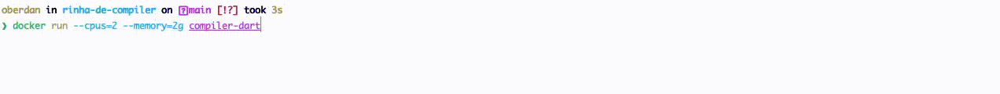

[](https://github.com/aripiprazole/rinha-de-compiler)

## Implementação usando Dart

Esse projeto tem como objetivo implementar o desafio proposto na [rinha de compiladores](https://github.com/aripiprazole/rinha-de-compiler).

A intenção não é submeter essa implementação para participar da competição e sim apenas o desafio pessoal, dado que este é um assunto extremamente interessante.

Por que a implementação usando o Dart? Simplesmente pelo fato que atualmente é a linguagem que estou dedicado no momento, através do Flutter.

No entanto, futuramente a ideia é adaptar essa implementação para outras linguagens, como o Typescript, por exemplo.

## Como rodar

### Localmente

A primeira forma de rodar o projeto é instalando o Dart localmente no computador, utilizando preferencialmente o gerenciador de pacotes favorito do respectivo sistema operacional. A versão do Dart recomendado é a 3.1.1.

Em seguida, deve-se rodar os seguintes comandos:

```Shell
dart pub get
```

Para a instalação das bibliotecas.

```Shell
dart compiler-dart/bin/compiler.dart
```

Para executar o programa. Esse comando dever ser rodado na raiz do projeto.

### Docker

A alternativa mais trivial é rodar o projeto via docker. O arquivo Dockerfile possui todas as instruções necessárias para deixar o ambiente pronto, como, por exemplo, o download e instalação do sdk do Dart, a instalação das bibliotecas necessárias do projeto, cópia do arquivo de entrada e, por fim, a sua execução.

Para isso, é necessário duas etapas. O <b>build</b>, para criar a imagem, e o <b>run</b> para criar e executar o container. 

#### Docker build
```Shell
docker build -t compiler-dart .
```

#### Docker run
```Shell
docker run --cpus=2 --memory=2g compiler-dart
```

A execução do projeto leva em consideração os limites de cpus (2 núcleos) e de memória (2G de RAM) a ser utilizada, como especificados nos requisitos da rinha.

### Resultado

O resultado final acompanha a regra especificada da rinha. É necessário ter um arquivo <b>var/rinha/source.rinha</b>, com o algoritmo a ser testado, que nesse caso é um fibonacci tradicionalmente conhecido, com duas chamadas recursivas, e um outro arquivo JSON <b>var/rinha/source.rinha.json</b>, que é a AST (Abstract Syntax Tree), do respectivo algoritmo, gerado pelo interpretador <b>rinha</b>, implementado pela [Sofia](https://twitter.com/algebraic_sofia) e pela [Gabi](https://twitter.com/algebraic_gabi), organizadoras do desafio.

O arquivo JSON da AST está estaticamente embutido no código Dart implementado, sendo lido e interpretado, para no final ter seu resultado gerado.

O resultado final é um fibonacci de 10.




### Outros exemplos

Outros exemplos de algoritmos estão listados no diretório <b>test</b> como, por exemplo, testes com os operadores binários, condicionais, tuplas, e um algoritmo de combinações entre dois números.

Além disso, há um algoritmo de fibonacci usando o conceito de TCO (Tail-Call Optimization), onde, resumidamente, há uma única chamada recursiva e esta localiza-se isoladamente na última instrução do corpo da função, ou seja, em sua "calda". Dessa forma não há nenhuma dependência do retorno da chamada recursiva, permitindo que o compilador realize otimizações, como limpeza de memória, por exemplo, para evitar os estouros de pilha (Stack Overflow). 

Apesar do interpretador implementado conseguir executar o fibonacci TCO, até o momento da escrita desse projeto, o Dart não possui nativamente essa otimização. O próximo passo é justamente implementá-lo, permitindo executar o fibonacci com valores maiores, pois atualmente o valor máximo conseguido, sem bugs ou inconsistências, gira por volta de 1300.